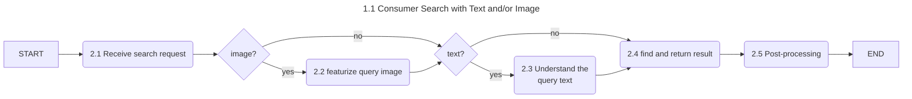

```mermaid
---
title: 1.1 Consumer Search with Text and/or Image
---
flowchart LR
    ST[START]--> RSR(2.1 Receive search request)
    RSR --> IQ{image?}
    IQ--> |yes| FI(2.2 featurize query image)
    IQ --> |no| TQ{text?}
    FI --> TQ 
    TQ --> |yes| D1(2.3 Understand the<br>query text)
    TQ --> |no| E1(2.4 find and return result)
    D1 --> E1
%%    D1 --> E1(search for<br>candidates)
%%    E1 --> E2(Rerank & filter logic)
    E1 --> F(2.5 Post-processing)
%%    F --> G(update statistics)
    F --> END[END] 


```
