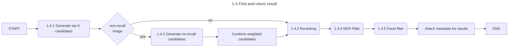

```mermaid
---
title: 1.4 Find and return result
---
flowchart LR
    ST[START] --> GCK(1.4.1 Generate top K candidates)
    GCK --> NRI{non-recall<br>image}
    NRI --> |yes| NRC(1.4.2 Generate no-recall candidates)
    NRI --> |no| RR(1.4.3 Reranking)
    NRC --> CB[Combine weighted candidates]
    CB --> RR
    RR --> FTLNER(1.4.4 NER Filter)
    FTLNER --> FTLFAC(1.4.5 Facet filter)
    FTLFAC --> AMD[Attach metadata for results]
    AMD --> ED[END]
```
