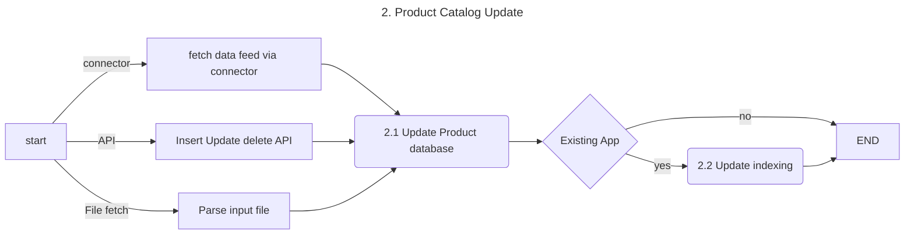

```mermaid
---
title: 2. Product Catalog Update
---
flowchart LR
    ST[start] -- connector --> CON[fetch data feed via connector]
    ST -- API --> AP[Insert Update delete API]
    ST -- File fetch --> FF[Parse input file]
    CON --> UP
    AP --> UP
    FF --> UP(2.1 Update Product database)
    UP --> APP{Existing App}
    APP --> |yes| UI(2.2 Update indexing)
    APP --> |no| ED[END]
    UI --> ED[END] 


```
