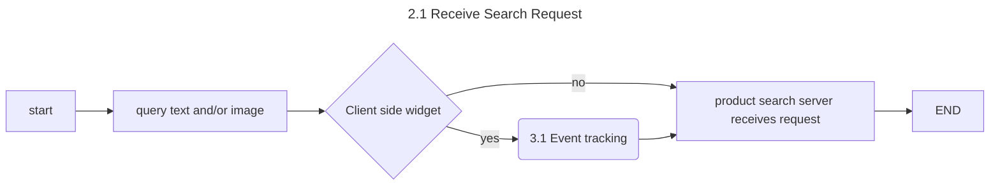

```mermaid
---
title: 2.1 Receive Search Request
---
flowchart LR
    ST[start] --> QU[query text and/or image]
    QU --> WI{Client side widget}
    WI --> |yes| ET(3.1 Event tracking)
    WI --> |no| PS[product search server receives request]
    ET --> PS
    PS --> EN[END]
```
