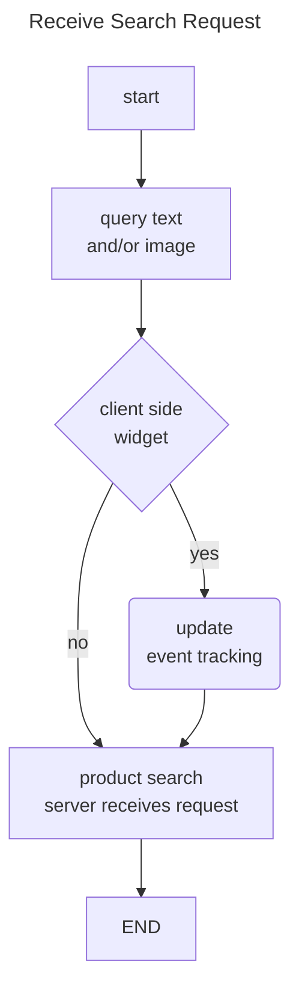

```mermaid
---
title: Receive Search Request
---
flowchart TD
    ST[start] --> QU[query text<br>and/or image]
    QU --> WI{client side<br>widget}
    WI --> |yes| ET(update<br>event tracking)
    WI --> |no| PS[product search<br>server receives request]
    ET --> PS
    PS --> EN[END]
```
