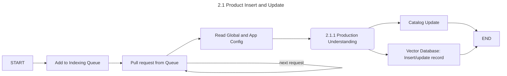

```mermaid
---
title: 2.1 Product Insert and Update
---
flowchart LR
    ST[START] --> IQ[Add to Indexing Queue]
    IQ --> PQ[Pull request from Queue]
    PQ -- next request --> PQ
    PQ --> RC[Read Global and App Config]
    RC --> PU(2.1.1 Production Understanding)
    PU --> CU[Catalog Update]
    PU --> VD[Vector Database: Insert/update record]
    CU --> ED[END]
    VD --> ED
```
