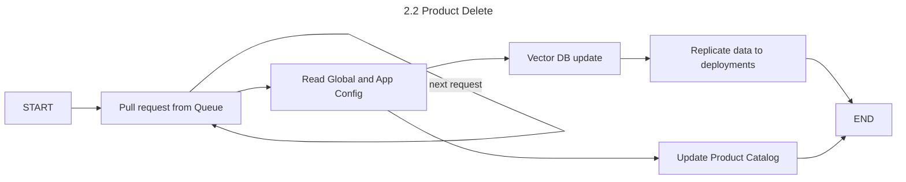

```mermaid
---
title: 2.2 Product Delete
---
flowchart LR
    ST[START] --> PQ[Pull request from Queue]
    PQ -- next request --> PQ
    PQ --> RC[Read Global and App Config]
    RC --> CU[Update Product Catalog]
    RC --> VD[Vector DB update]
    VD --> REP[Replicate data to deployments]
    REP --> ED[END]
    CU --> ED
```
