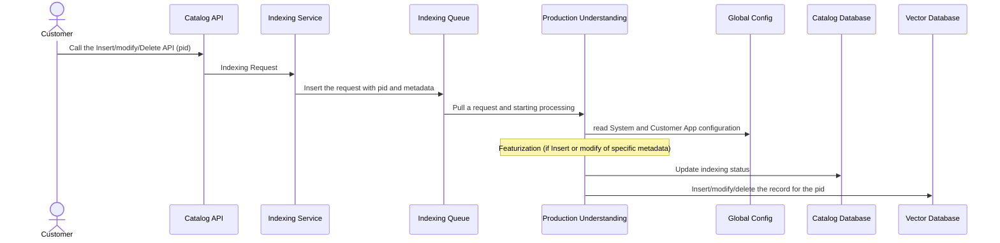

```mermaid
sequenceDiagram
    Actor Customer
    Customer->> Catalog API: Call the Insert/modify/Delete API (pid)
    Catalog API ->> Indexing Service: Indexing Request
    Indexing Service ->> Indexing Queue: Insert the request with pid and metadata
    Indexing Queue ->>  Production Understanding: Pull a request and starting processing
    Production Understanding ->> Global Config: read System and Customer App configuration
    Note over Production Understanding : Featurization (if Insert or modify of specific metadata)
    Production Understanding ->> Catalog Database : Update indexing status
    Production Understanding ->> Vector Database: Insert/modify/delete the record for the pid
```
