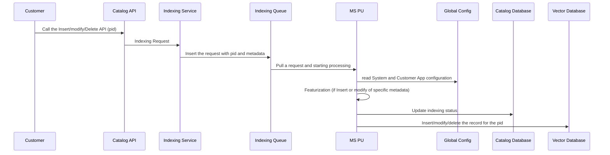

```mermaid
sequenceDiagram
    Customer->> Catalog API: Call the Insert/modify/Delete API (pid)
    Catalog API ->> Indexing Service: Indexing Request
    Indexing Service ->> Indexing Queue: Insert the request with pid and metadata
    Indexing Queue ->>  MS PU: Pull a request and starting processing
    MS PU ->> Global Config: read System and Customer App configuration
    MS PU ->> MS PU : Featurization (if Insert or modify of specific metadata)
    MS PU ->> Catalog Database : Update indexing status
    MS PU ->> Vector Database: Insert/modify/delete the record for the pid
```
