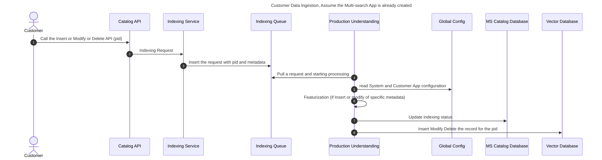

```mermaid
sequenceDiagram
    autonumber
    title Customer Data Ingestion, Assume the Multi-search App is already created
    Actor Customer
    Customer->> Catalog API: Call the Insert or Modify or Delete API (pid)
    Catalog API ->> Indexing Service: Indexing Request
    Indexing Service ->> Indexing Queue: Insert the request with pid and metadata
    Production Understanding ->> Indexing Queue : Pull a request and starting processing
    Production Understanding ->> Global Config: read System and Customer App configuration
    Production Understanding ->> Production Understanding: Featurization (if Insert or modify of specific metadata)
    Production Understanding ->> MS Catalog Database : Update indexing status
    Production Understanding ->> Vector Database: Insert Modify Delete the record for the pid
```
