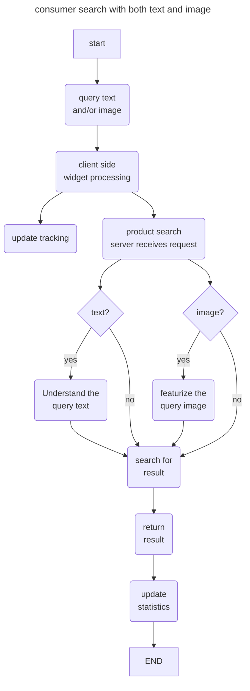

```mermaid
---
title: consumer search with both text and image
---
flowchart TD
    ST[start] --> A(query text<br>and/or image)
    A --> B(client side<br>widget processing)
    B --> S(update tracking)
    B --> C(product search<br>server receives request)
    C --> TQ{text?}
    TQ--> |yes| D1(Understand the<br>query text)
    C --> IQ{image?}
    IQ--> |yes| D2(featurize the<br>query image)
    D1 --> E(search for<br>result)
    D2 --> E
    TQ--> |no| E
    IQ--> |no| E 
    E --> F(return<br>result)
    F --> G(update<br>statistics)
    G --> END[END] 


```
