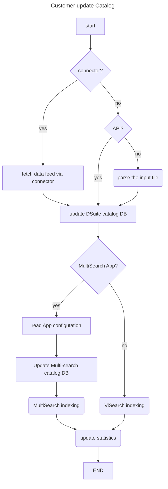

```mermaid
---
title: Customer update Catalog
---
flowchart TD
    ST[start] --> A{connector?}
    A-->|yes| A1[fetch data feed via connector]
    A --> |no| B{API?}
    B -->|yes| C[update DSuite catalog DB]
    B --> |no| S(parse the input file)
    A1 --> C
    S --> C
    C --> TQ{MultiSearch App?}
    TQ--> |yes| D0[read App configutation]
    D0--> D1[Update Multi-search catalog DB]
    D1 --> E1(MultiSearch indexing)
    TQ--> |no| D2(ViSearch indexing)
    D2-->G(update statistics)
    E1 --> G
    G --> END[END] 


```
